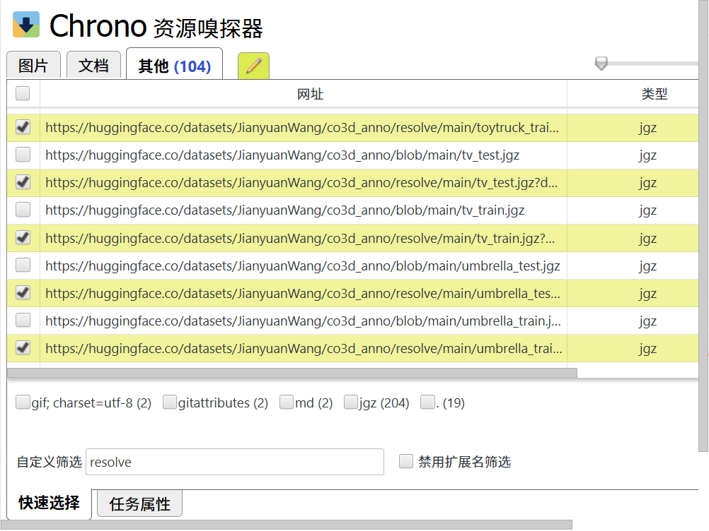
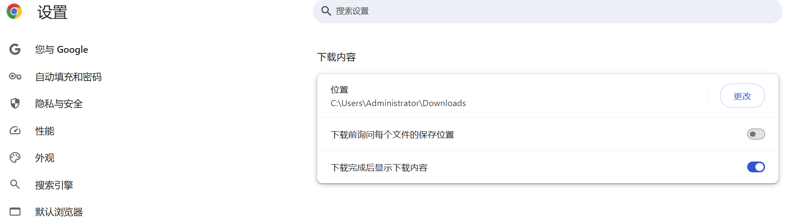

## 📋 TODO: Dataset Preparation

- [x] Co3Dv2  
- [ ] BlendMVS  
- [ ] DL3DV  
- [ ] MegaDepth  
- [ ] Kubric  
- [ ] WildRGB  
- [ ] ScanNet  
- [ ] HyperSim  
- [ ] Mapillary  
- [ ] Taskonomy  
- [ ] Habitat  
- [ ] Replica  
- [ ] MVS-Synth  
- [x] Virtual KITTI  
- [ ] Aria Synthetic Environments  
- [ ] Aria Digital Twin  
- [ ] A synthetic dataset of artist-created assets similar to Objaverse

## 🛠️ 使用方法

1. 执行以下命令下载数据：
   ```bash
   bash download.sh
2. 下载chrome插件 https://chrome.google.com/webstore/detail/chrono-download-manager/mciiogijehkdemklbdcbfkefimifhecn
3. 插件筛选一共104个文件
   
4. 修改下载路径，不询问
   
